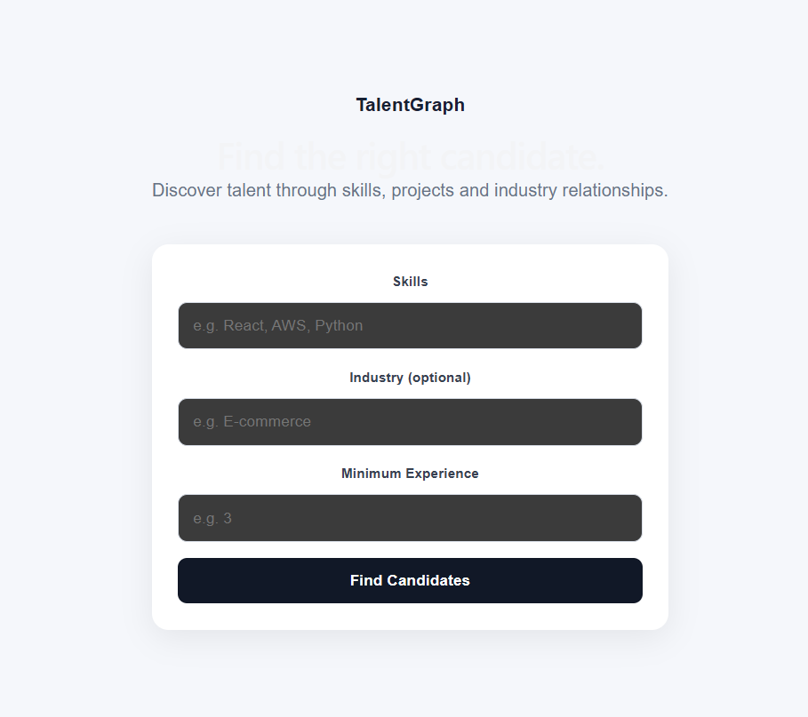
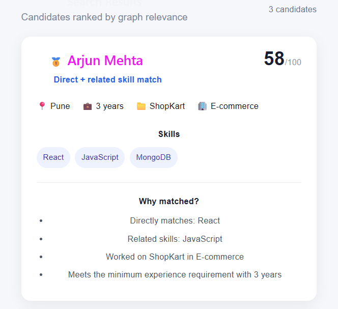
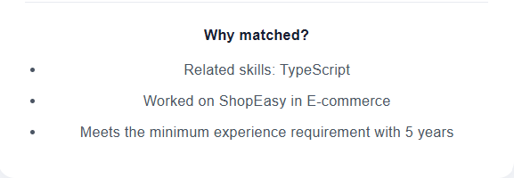

# TalentGraph

TalentGraph is a graph-based candidate discovery application built with
**CognoDB, FastAPI, and React**.

It helps recruiters find candidates based on **skills, experience, projects,
and industry relationships**, including related-skill matches.

---

## Problem

Traditional candidate search often depends on exact skill matching.

For example, a recruiter searching for `React` may miss a candidate who has
`TypeScript`, even when the two skills are related.

TalentGraph uses graph relationships to discover these connections.

---

## Why a Graph Database?

TalentGraph is based on relationships:

```text
Candidate ──HAS_SKILL──> Skill
Candidate ──WORKED_ON──> Project
Project ──IN_DOMAIN──> Industry
Skill ──RELATED_TO──> Skill
```

For example:

```text
Candidate
    |
    | HAS_SKILL
    v
TypeScript
    |
    | RELATED_TO
    v
React
```

This allows the application to find candidates through multi-hop
relationships rather than relying only on exact keyword matching.

A relational implementation would require multiple joins between candidate,
skill, project, industry, and skill-relationship tables. Graph traversal makes
these relationships explicit and natural to query with Cypher.

---

## Features

- Search using one or multiple skills
- Minimum experience filtering
- Optional industry filtering
- Direct skill matching
- Related skill matching
- Graph-based candidate ranking
- Match explanations
- Loading, empty, and error states

---

## Graph Data Model

### Nodes

| Node | Properties |
|------|------------|
| Candidate | id, name, experience, location |
| Skill | name |
| Project | name |
| Industry | name |

### Relationships

```text
Candidate ──HAS_SKILL──> Skill
Candidate ──WORKED_ON──> Project
Project ──IN_DOMAIN──> Industry
Skill ──RELATED_TO──> Skill
```

### Graph Diagram

```text
Candidate ──HAS_SKILL──> Skill
    │                       │
    │                       │ RELATED_TO
    │                       ▼
    │                     Skill
    │
    │ WORKED_ON
    ▼
Project ──IN_DOMAIN──> Industry
```

---

## Architecture

```text
┌───────────────┐
│   React UI    │
└───────┬───────┘
        │ HTTP
        ▼
┌───────────────┐
│    FastAPI    │
│ Search/Score  │
└───────┬───────┘
        │ Cypher
        ▼
┌───────────────┐
│    CognoDB    │
│ Graph Database│
└───────────────┘
```

---

## Candidate Matching

The search process:

1. Filter candidates by minimum experience.
2. Optionally filter by industry.
3. Find direct skill matches.
4. Traverse `RELATED_TO` relationships for related skills.
5. Calculate a relevance score.
6. Return candidates ranked by score.
7. Provide an explanation for each match.

---

## Scoring

The score considers:

- Skill relevance
- Industry/domain match
- Skill/technology breadth
- Experience

Direct skill matches receive a higher skill score than related matches.

The API also returns the matched skills and reasons for the match.

---

## Cypher

The application uses parameterized Cypher queries through the official Neo4j
Python driver.

### Candidate → Project → Industry

```cypher
MATCH (c:Candidate)-[:WORKED_ON]->(p:Project)-[:IN_DOMAIN]->(i:Industry)
WHERE c.experience >= $experience
  AND ($industry IS NULL OR i.name = $industry)
```

This is a multi-hop traversal:

```text
Candidate → Project → Industry
```

### Related Skill Matching

```cypher
MATCH (c:Candidate)-[:HAS_SKILL]->(related:Skill)
      -[:RELATED_TO]->(target:Skill)
WHERE target.name IN $skills
```

This allows a candidate with a related skill to match the requested skill.

User input is passed as query parameters rather than concatenated into Cypher.

---

## Seed Data

Realistic demonstration data is included through:

```text
backend/seed.py
```

It creates candidates, skills, projects, industries, and their relationships.

Run from the `backend` directory:

```bash
python seed.py
```

---

## Technology Stack

**Frontend**

- React
- Vite
- JavaScript
- CSS

**Backend**

- Python
- FastAPI
- Uvicorn
- Pydantic

**Database**

- CognoDB
- openCypher
- Bolt
- Official Neo4j Python driver

---

## Project Structure

```text
TalentGraph/
├── backend/
│   ├── main.py
│   ├── seed.py
│   ├── requirements.txt
│   └── .env
├── data/
├── frontend/
├── .gitignore
└── README.md
```

`.env`, virtual environments, `node_modules`, and Python cache files are
excluded from Git.

---

## Setup

### 1. Create a CognoDB Instance

1. Create an account at the CognoDB Cloud console.
2. Create a free `c0` instance.
3. Select a region.
4. Copy the Bolt URI and generated password.

The URI will look similar to:

```text
bolt+s://<instance-id>.databases.cognodb.cloud
```

### 2. Configure Environment Variables

Create:

```text
backend/.env
```

Add:

```env
COGNODB_URI=bolt+s://<instance-id>.databases.cognodb.cloud
COGNODB_USERNAME=cognodb
COGNODB_PASSWORD=<your-password>
```

Never commit the real `.env` file.

---

## Run Backend

```powershell
cd backend
python -m venv .venv
.venv\Scripts\activate
python -m pip install -r requirements.txt
python seed.py
python -m uvicorn main:app --reload
```

Backend:

```text
http://127.0.0.1:8000
```

API documentation:

```text
http://127.0.0.1:8000/docs
```

---

## Run Frontend

Open another terminal:

```powershell
cd frontend
npm install
npm run dev
```

Frontend:

```text
http://localhost:5173
```

---

## API

### `POST /search`

Example request:

```json
{
  "skills": ["React", "AWS"],
  "experience": 3,
  "industry": "E-commerce"
}
```

Industry is optional:

```json
{
  "skills": ["React", "AWS"],
  "experience": 3,
  "industry": null
}
```

The response contains ranked candidates with:

- Candidate information
- Score
- Match type
- Matched skills
- Related skills
- Project
- Industry
- Explanation

---

## Screenshots

### Search



### Results



### Match Explanation



---

## Demo

**Hosted Application:**  
[Open TalentGraph](https://talentgraph-delta.vercel.app)

**Screen Recording:**  
[Watch the Demo](https://drive.google.com/file/d/1uhQJyZ4kiQ_297v6vzi4MRqzH-eefIIC/view?usp=sharing)

---

## Error Handling

The application handles:

- Backend connection failures
- Database connection failures
- Invalid requests
- No matching candidates

The frontend displays an appropriate error state when the backend is
unavailable.

---

## Security

Database credentials are stored in environment variables.

The following are excluded from Git:

```text
.env
.venv/
venv/
node_modules/
__pycache__/
```

No database credentials are committed to the repository.

---

## Future Improvements

- Interactive graph visualization
- More advanced skill similarity
- Candidate profile pages
- Candidate comparison
- Larger datasets

---

## Author

**Ajinkya Paranjape**

Built with CognoDB, FastAPI, React, and the official Neo4j Python driver.
